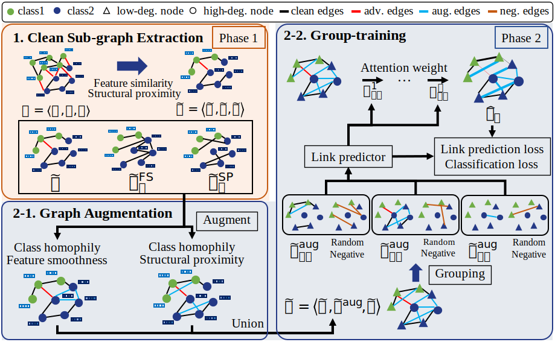

# SG-GSR: Self-guided Robust Graph Structure Refinement
## Main Figure
</img> 


### Requirements

- Python version: 3.7.11
- Pytorch version: 1.10.2
- torch-geometric version: 2.0.3
- deeprobust version: 0.2.4

### How to run
You can run the model with following options
- Pretrain structural features (node2vec)
```
sh pretrain_node2vec.sh
```

- To reproduce Table 1 in paper
```
sh train_SGGSR.sh
```

### Data generation
You can generate graph dataset with e-commerce fraud, i.e., Garden and Pet.
```
sh create_ecommerce_fraud.sh
```

Note that before executing the above code, you should download the raw data (i.e., Amazon review data) from the attached [link](http://jmcauley.ucsd.edu/data/amazon/links.html)
